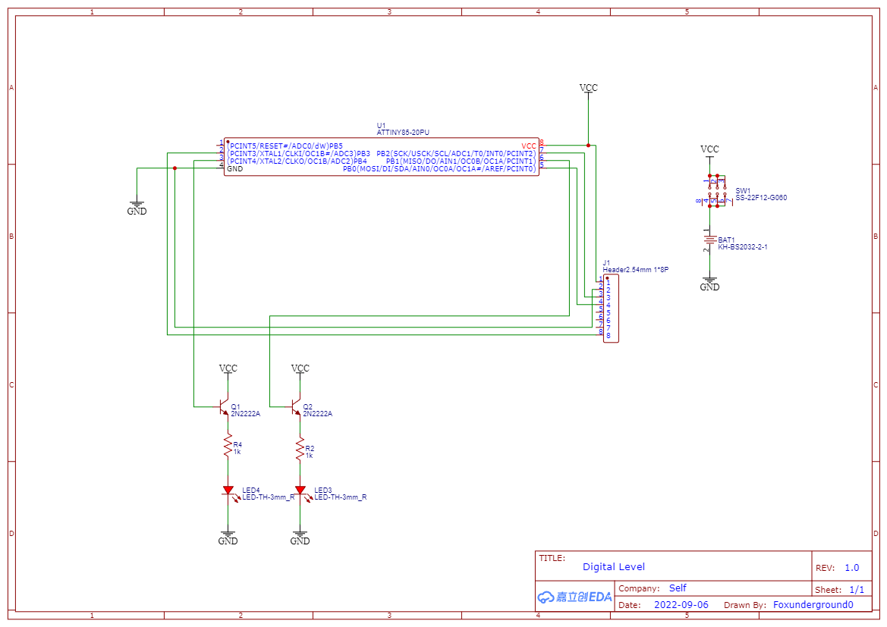
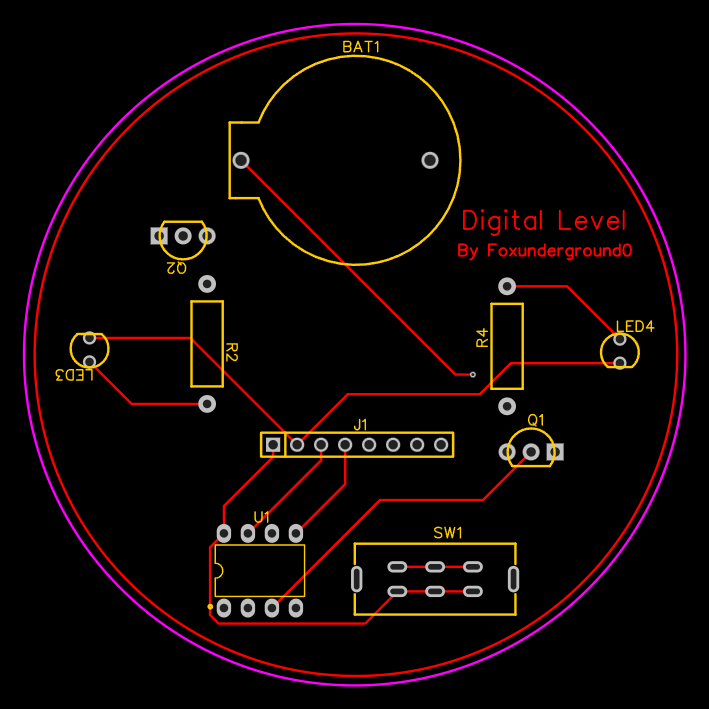

# Digital Level Meter

Digital Level Meter is a project built using an ATtiny85 microcontroller and an MPU-6050 accelerometer and gyroscope module. The project aims to measure and display the tilt angle using LEDs, providing a digital representation of the levelness of an object.

## Features

- Measures tilt angle using the MPU-6050 accelerometer and gyroscope module
- Utilizes the ATtiny85 microcontroller for control and processing
- Provides real-time levelness feedback through LEDs
- Implements sleep modes to conserve power when not in use

## Hardware Requirements

- ATtiny85 microcontroller
- MPU-6050 accelerometer and gyroscope module
- LEDs (positive and negative indicators)
- Resistors, capacitors, and other necessary components for circuit connections

## Circuit Diagram

## PCB Layout

The PCB layout files for the Digital Level Meter project are located in the "pcb_layout" directory. The layout files are created using [PCB design software]([https://easyeda.com](https://easyeda.com/)).
You can use these files to manufacture the PCB for the Digital Level Meter project. Feel free to modify the layout according to your specific requirements.

## Installation

1. Clone or download the repository: `git clone https://github.com/your-username/digital-level-meter.git`
2. Connect the ATtiny85 and MPU-6050 module according to the provided circuit diagram.
3. Upload the Arduino sketch (`main.ino`) to the ATtiny85 microcontroller using an AVR programmer or Arduino as ISP.
4. Manufacture the PCB using the provided layout files and assemble the components.
5. Power on the circuit and observe the LED indicators for the tilt angle readings.

## Usage

1. Ensure the circuit is powered on and the LEDs are functioning properly.
2. Place the digital level meter on the object or surface to be measured.
3. Observe the LED indicators:
   - If the positive LED is lit, the object is tilted in the positive direction.
   - If the negative LED is lit, the object is tilted in the negative direction.
   - If both LEDs are off, the object is close to being level.
4. Adjust the position of the object until the LEDs indicate a level state.

## Contributing

Contributions to the Digital Level Meter project are welcome! If you have any ideas, suggestions, or bug reports, please open an issue or submit a pull request. Make sure to follow the project's code of conduct.

## License

The Digital Level Meter project is open source and available under the [MIT License](LICENSE).

## Acknowledgements

- The project was inspired by the need for a simple and portable level meter.
- Thanks to the authors and contributors of the libraries used in this project, such as TinyWireM.
